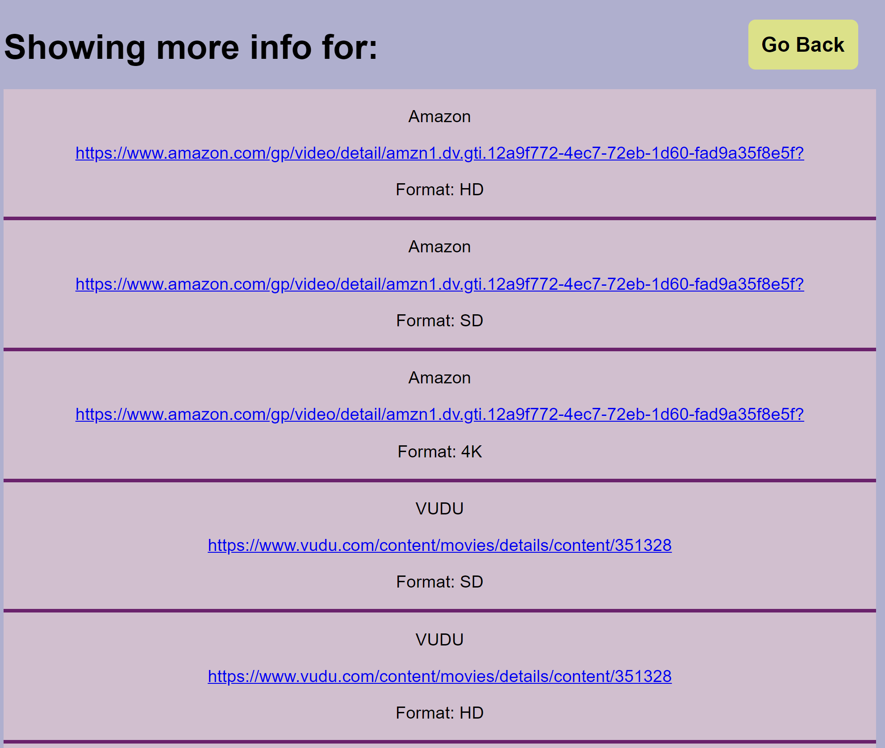

# Movie Randomizer

## Description

Our motivation for this project was to make a fun way to pick a movie when you are not really sure what you should watch for the night. In this project, we put together a website that will randomize a movie pulling the information from the extensive IMDb library of top 250 movies to make sure there are many options to be picked from. Afterwards, you are able to use the link at the bottom of the page to take you to a list of places to stream the movie you found. This way you don't need to go searching around for it. While working on this project we learned a lot about how to use external APIs and using github collaboration in order to make pull requests and have our peers review them before merging out content into the main branch. The problem that we solved with our project is to help people pick out a movie to watch when nothing else comes to mind or to be a tool that people can use to discover something new to watch.

## Usage

[Link to our Randomizer](https://faye3091.github.io/Movie-Randomizer/)

## Credits

[Vanessa Villaluz](https://github.com/faye3091)

[Sophia Marousis](https://github.com/marousiss)

[Kweku Adarkwa](https://github.com/1kweku)

[Matthew DePietropolo](https://github.com/Sofuto22)

Third-pary assets used: 

[Watchmode](watchmode.com)

[IMDB](https://www.imdb.com/)

## License

N/A

